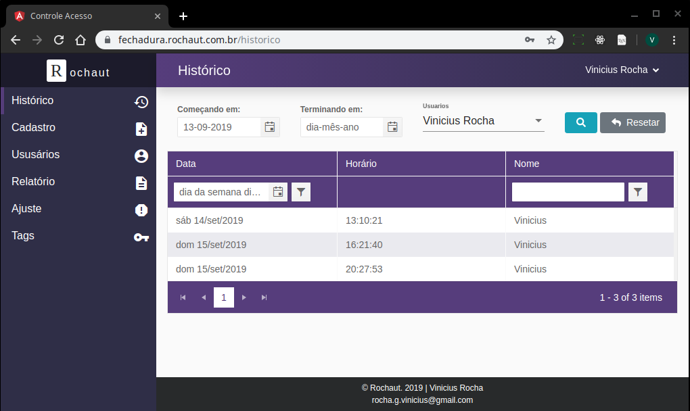

# Trabalho de Conclusão de curso

## Sistema de controle de acesso utilizando autenticação por RFID e gerenciamento por meio de software WEB

[Link para download do arquivo PDF de todo o projeto](https://www.monografias.ufop.br/handle/35400000/2222).

# Passos de configuração

## Utilizar a branch master

# Rodar o Front

Para executar a aplicação basta realizar o [git clone](https://github.com/viniciusrufop/controle_acesso_angular.git) do repositório, rodar o comando `npm install` e depois rodar `ng serve`.

# API do projeto

Para que tudo funcione corretamente é necessário estar com a api sendo executada em um servidor PHP. [Repositório da API](https://github.com/viniciusrufop/controle_acesso_lumen.git), depois alterar o arquivo `/src/environments/environment.ts` com o redirecionamento para a API.

# Firmware do projeto

O firmware foi feito utilizando a linguagem Arduino, que tem por base a linguagem C++. Algumas funções foram feitas utilizando FreeRTOS, que é um sistema operacional de tempo real. A placa de desenvolvimento utilizada no projeto foi a **ESP32-DevKitC**. [Repositório do Firmware](https://github.com/viniciusrufop/controle_acesso_firmware.git)

# Algumas Imagens

